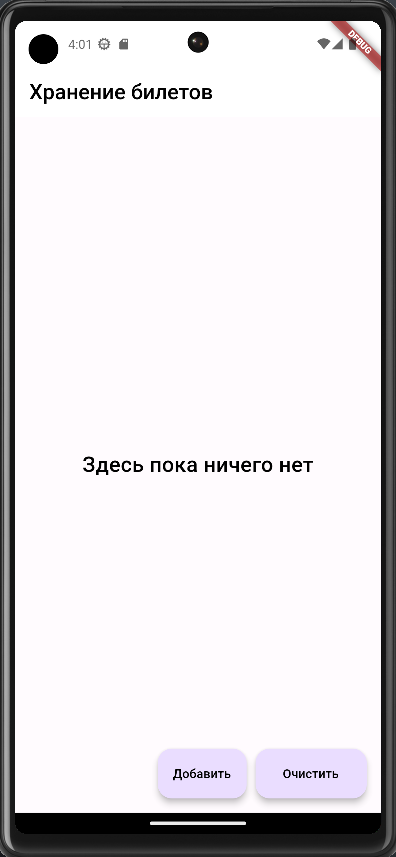
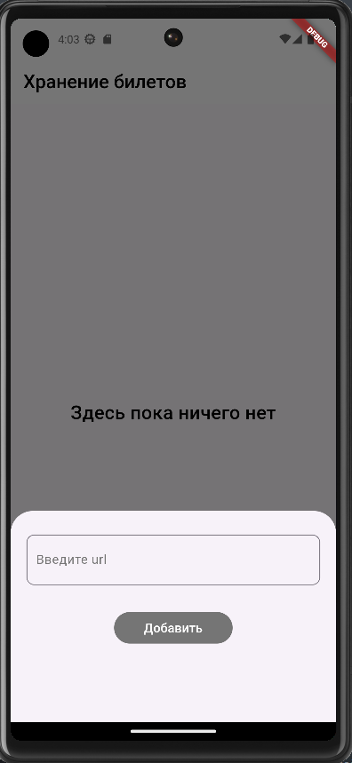
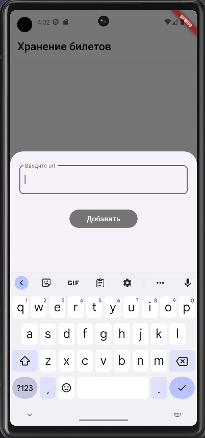
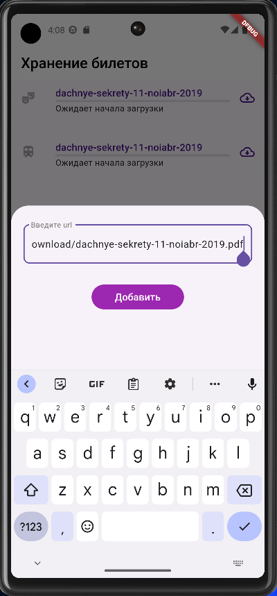
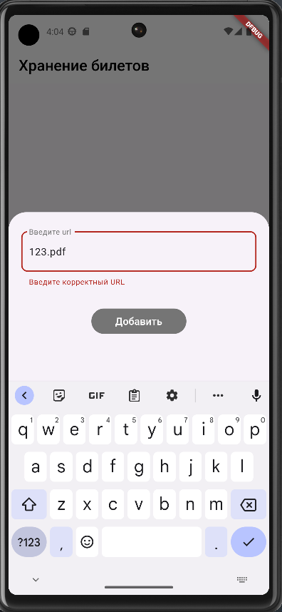
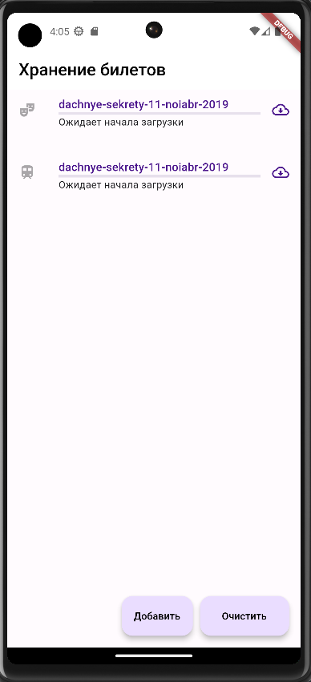

# Целевая платформа

Android Pixel 6

# Результаты

- [x] Реализовал модель данных для хранения информации о билетах
- [x] Реализовал экран отображения списка билетов
- [x] Реализовал добаление ссылки на загрузку билета и ее валидацию
- [x] Реализовал автоматический ввод ссылки на билет, если она была скопирована в буфер обмена
- [x] Реализовал возможность удаления всех билетов при нажатии на кнопку "Очистить"

# Ссылки на демонстрацию работы/скриншоты

  
  

  
  

  

